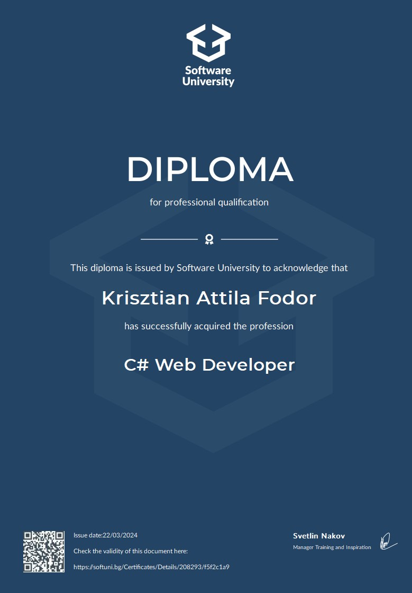

# Software Engineering - CSharp Full-Stack Developer Career Path @ SoftUni 2022-2024

  

## Mandatory (Path) course repositories:

* CSharp - Basics (January 2022)
* CSharp - Fundamentals (May 2022)
* CSharp - Advanced
    * Advanced (September 2022)
    * OOP (October 2022)
* CSharp - DB
    * MS SQL (January 2023)
    * Entity Framework Core (February 2023)
* CSharp - Web
    * HTML&CSS - Mini Course (April 2023) - Noncertifiable -> Introduction (no credits)
    * ASP.NET - Fundamentals (May 2023)
    * ASP.NET - Advanced (June 2023)
* JavaScript - Front-End
    * HTML&CSS (September 2023)
    * JS Front-End (October 2023)

| Index | Course Curriculum                                                                                        | Certificate                                                                                 | Final Project                                                    | Credits          
|:------:|:--------------------------------------------------------------------------------------------------------|:--------------------------------------------------------------------------------------------|:----------------------------------------------------------------:|:----------------------------:
|   01. | [C# Basics Curriculum](https://softuni.bg/courses/programming-basics)                                    | [Programming Basics](https://softuni.bg/certificates/details/124163/4f111e75)               |                                                                  | 3
|   02. | [C# Fundamentals Curriculum](https://softuni.bg/courses/programming-fundamentals-csharp-java-js-python)  | [Programming Fundamentals](https://softuni.bg/certificates/details/139285/2a887f18)         |                                                                  | 12
|   03. | [C# Advanced Curriculum](https://softuni.bg/modules/58/csharp-advanced/1357)                             | [C# Advanced](https://softuni.bg/certificates/details/143932/ea987587)                      |                                                                  | 12
|   04. | [C# OOP Curriculum](https://softuni.bg/trainings/3843/csharp-oop-october-2022)                           | [C# OOP](https://softuni.bg/certificates/details/150719/53829fbc)                           |                                                                  | 15
|   05. | [MS SQL Curriculum](https://softuni.bg/trainings/3965/ms-sql-january-2023)                               | [MS SQL](https://softuni.bg/certificates/details/157832/0c96a1b9)                           |                                                                  | 9
|   06. | [EF-Core Curriculum](https://softuni.bg/trainings/3966/entity-framework-core-february-2023)			   | [Entity Framework Core](https://softuni.bg/certificates/details/164861/ef7326ac)      		 |                                                                  | 15
|   07. | [HTML & CSS Mini Course Curriculum](https://softuni.bg/trainings/2286/html-css-mini-course)			   | Noncertifiable                                                                        		 |                                                                  |
|   08. | [ASP.NET Fundamentals Curriculum](https://softuni.bg/trainings/3966/entity-framework-core-february-2023) | [ASP.NET Fundamentals](https://softuni.bg/certificates/details/175351/3dbfbae1)             |                                                                  | 15
|   09. | [ASP.NET Advanced Curriculum](https://softuni.bg/trainings/3966/entity-framework-core-february-2023)	   | [ASP.NET Advanced](https://softuni.bg/certificates/details/182177/0f14abe7)                 | [Sky Tracker App](https://github.com/KaiserDMC/Sky-Tracker-App)  | 15
|   10. | [HTML & CSS Curriculum](https://softuni.bg/trainings/4239/html-and-css-september-2023)	               | [HTML & CSS](https://softuni.bg/certificates/details/190832/9b2b2d39)                     	 |                                                                  | 12
|   11. | [JS Front-End Curriculum](https://softuni.bg/trainings/4240/js-front-end-october-2023)	               | [JS Front-End](https://softuni.bg/certificates/details/199189/8cf6100e)                     |                                                                  | 15
---

## Open course repositories (these courses are taken in order to reach the required 140 credits for "C# Web Developer" certification and the required 160 credits for "C# Full-Stack Developer" certification):

* Windows System Administration (March 2023)
* Linux System Administration (June 2023)
* Algorithms Fundamentals with C# (November 2023) - Noncertifiable -> Discontinued by SoftUni (no credits)
* Data Structures Fundamentals with C# (January 2024) - Noncertifiable -> Discontinued by SoftUni (no credits)
* Containers and Cloud (January 2024)
* Software Engineering and DevOps (February 2024)
* TypeScript (April 2024)

| Index | Open Courses Curriculum																				                            | Additional Certification (min 140 credits)              					 | Credits                           
|:------:|:---------------------------------------------------------------------------------------------------------------------------------|:---------------------------------------------------------------------------|:----------------------------:
|   12. | [Windows System Administration](https://softuni.bg/trainings/4082/windows-system-administration-march-2023)                       | [WSA](https://softuni.bg/certificates/details/171863/406d88db)             | 6
|   13. | [Linux System Administration](https://softuni.bg/trainings/4083/linux-system-administration-june-2023)                            | [LSA](https://softuni.bg/certificates/details/178921/491ce0aa)             | 6
|   14. | [Algorithms Fundamentals (C#)](https://softuni.bg/trainings/4175/algorithms-fundamentals-with-c-sharp-may-2023)                   | Noncertifiable                                        					 |
|   15. | [Data Structures Fundamentals (C#)](https://softuni.bg/trainings/4266/data-structures-fundamentals-with-csharp-september-2023)    | Noncertifiable                                    						 |
|   16. | [Containers and Cloud](https://softuni.bg/trainings/4359/containers-and-cloud-january-2024)                                       | [C&C](https://softuni.bg/Certificates/Details/206950/95577b3d)             | 12
|   17. | [Software Engineering and DevOps](https://softuni.bg/trainings/4360/software-engineering-and-devops-february-2024)                | Pending                                       			 			     | 12
|   18. | [TypeScript](https://softuni.bg/trainings/4550/typescript-april-2024)                                                             | Pending                                       			 			     | 9
---

### Diploma C# Web Developer

Click on the image above to view the full diploma.

